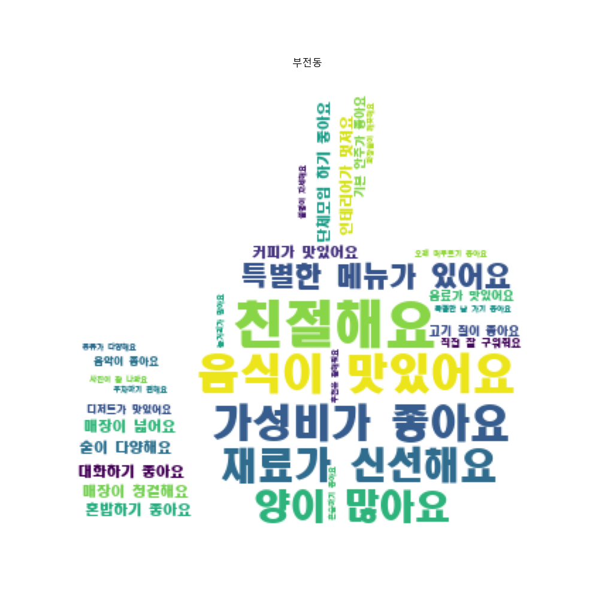

# 건강기능식품 복용 분석

 

## 1. 프로젝트 목적
- **팀 목표** : 데이터 기반으로 소비자의 반응 분석 및 챗봇 서비스 구현
- **개인 목표** : 지도/워드 클라우드 등 다양한 시각화 활용하여 EDA

 

## 2. 프로젝트 기간 및 참여인원
📅 2023.08.22~2023.08.28 (**7일**) / 👥 5명

 

## 3. 담당 역할
- 속도향상과 중간저장 기능을 추가한 웹 크롤링 코드
- 지도시각화 및 워드클라우드로 부산진구 동별 일반음식점 특성 EDA
    

      
      
    

  - 키워드별 부산진구 동별 일반음식점 특성 EDA를 진행한 결과, 부전동(갈색)과 전포동(청록색)에 음식점이 과밀집되어 있음
  - 이는 비수도권의 최대 상권이기에 음식점 상권도 몰려있기 때문으로 판단됨
    

      
      
      
    

  - 워드클라우드 시각화로 부산진구 10개 동의 일반음식점 특성 EDA한 결과, ‘친절해요’, ‘음식이 맛있어요’가 부산진구 일반음식점의 공통된 특성으로 나타남
        

